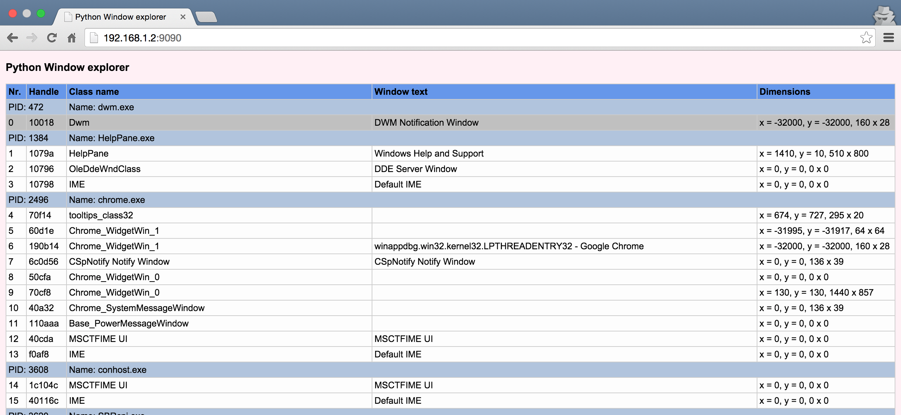

### win32-server

Simple python tool to observe all opened windows properties.

### auto-gui

Python tool to automatically click on popups. Can be used with fuzzing
tools.

List of files:
 * click.py - tool itself
 * sched.bat - bat file that automates click.py launch ever 120 seconds
 * window.ini - configuration file (you can add own windows)

Requires pywin32.
